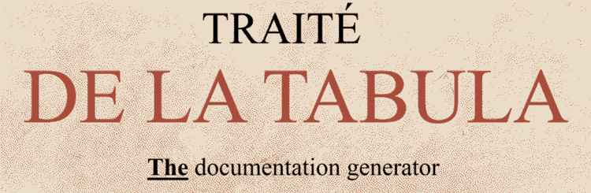
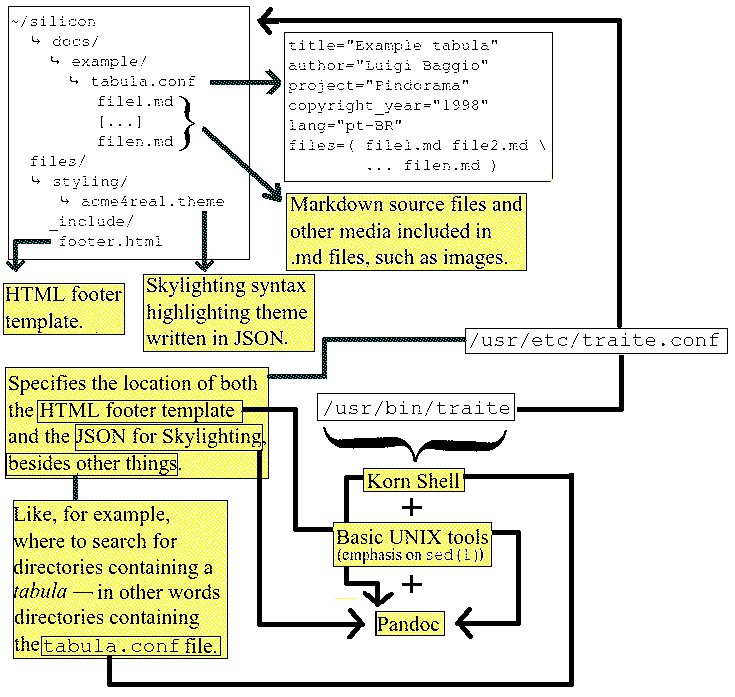

 

## What is it?

Traité de la *tabula* (a.k.a "``traite``" as its command-line name) is a static
documentation generator written purely in Korn Shell --- more specifically,
[KSH-93](http://www.kornshell.com/doc/ksh93.html). It uses
[Pandoc](https://pandoc.org) for converting from Markdown to HTML and,
indirectly, [XeTeX](https://tug.org/xetex/) as the default (La)TeX engine.  

### Why is the name in French?

The name originates from the optics book "*Traité de la lumière: Où Sont
Expliquées les Causes de ce qui Luy Arrive Dans la Reflexion & Dans la
Refraction*" (or, in short, "*Traité de la lumière*"), written by the Dutch
polymath Christiaan Huygens and published in 1690 in the French language.
Summarizing it --- since I could not in fact read it by its completness yet ---,
it introduces and elaborates Huygens' views on light, its nature and behavior.  
I had contact with it when I was in my High School junior year, making a Physics
coursework on light and telescopes (called "*Como a óptica influenciou a ciência:
o telescópio*"), and, although I did not had time to really read and dig deeper on
it, it marked me in some way at the time --- along with Isaac Newton's "*Optica*"
--- mostly because of the fact that it was written at the Enlightenment period
than of the contribution that it has done to the optics.

"*tabula*" is the name given for documents written for the Pindorama project,
served at the Silicon Tabula (``silicon.pindorama.dob.jp``). The Silicon Tabula
is a compilation of all the other *tabulas* written in the project.  
"*tabula*" means "tablet" in Latin; it came from "*Tabula Smaragdina*", which
served as inspiration for the 1974 album "*A Tábua de Esmeralda*" by the
Brazilian composer and singer Jorge Ben Jor, which then served as inspiration
for me, when I was studying for creating
[Copacabana](http://copacabana.pindorama.dob.jp) Linux® in 2021. So, since I was
wanting to make a tribute to Jorge Ben's work --- and, consenquently, to the
original *Tabula Smaragdina* --- I decided to call Pindorama's documentation of
"*tabula*" instead of "docs", "wiki" or anything else.  

Since this program builds the *tabulas* from Markdown to a stylized HTML with
pre-defined defaults for things such as theming, I decided to call it "Traité de
la *tabula*" because it is, in fact, a "treaty", that defines rules for how
everything shall looks like, where it shall be stored *et cetera*.  

## How it works?

The simple diagram below explains how this program works (click on it to see it
larger and with colours (92.0K)).  

## Dependencies

- KSH-93;
- sed;
- Pandoc;
- XeTeX

## Licence

Everything is licenced under the MIT licence, with an exception to the files at
the ``boilerplate/`` directory, which are licenced under Public Domain.  
